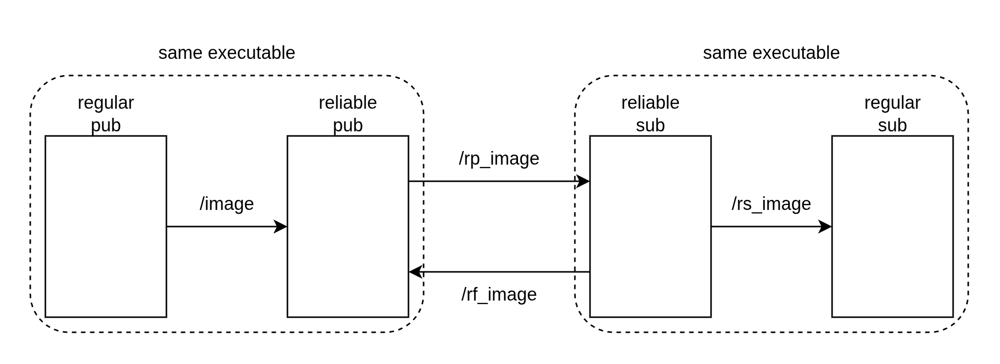

# Reliable Communication Wrapper for ROS 2

This package provides a template-based wrapper to ensure reliable message delivery between nodes operating in lossy network environments. It uses a "Reliable Publisher" and "Reliable Subscriber" pair to intercept and acknowledge traffic.

## Overview

The system bridges a standard publisher and subscriber by wrapping them with reliable intermediaries within the same executable:
1. Regular Pub → Reliable Pub: The regular_pub sends messages on a local topic (e.g., /image).
2. Reliable Pub → Reliable Sub: The reliable_pub forwards the message over the network on a prefixed topic (e.g., /rp_image). It stores the message in a buffer until an acknowledgement is received.
3. Reliable Sub → Reliable Pub (Feedback): Upon receiving a message, the reliable_sub sends a feedback signal (e.g., /rf_image) containing the unique ID of the message.
4. Reliable Sub → Regular Sub: Once a new message is verified as unique, it is forwarded to the final destination (e.g., /rs_image).



## Key Features

1. Message storage: Messages are stored in a buffer, until feedback is received that the messages are received by the other side.
2. Generic Templates: Both ReliablePub and ReliableSub are implemented as C++ template classes, allowing them to wrap any ROS 2 message type (e.g., sensor_msgs/msg/Image, std_msgs/msg/String).
3. Retrying: The messages in the buffer are published again every 5 seconds.
4. Deduplication: The ReliableSub uses an unordered_set of 64-bit unique IDs (generated from message timestamps) to ensure that re-transmitted messages are not processed multiple times.
5. Feedback Loop: Implements a custom acknowledgement protocol via the /rf_ topic prefix to signal successful receipt across lossy links.

## Usage Example

To run the ReliablePub or ReliableSub within your existing executable using a SingleThreadedExecutor or MultiThreadedExecutor:

```cpp
#include "reliable_sub.hpp"
#include "reliable_pub.hpp"
#include "sensor_msgs/msg/image.hpp"

int main(int argc, char * argv[]) {
    rclcpp::init(argc, argv);

    // --- new code starts ---
    // Instantiate the template for your specific message type
    auto reliable_node = std::make_shared<ReliableSub<sensor_msgs::msg::Image>>("reliable_sub_node", "/image");

    rclcpp::executors::SingleThreadedExecutor executor;
    executor.add_node(regular_node);
    executor.add_node(reliable_node);
    executor.spin();
    // --- new code ends ---

    rclcpp::shutdown();
    return 0;
}
```